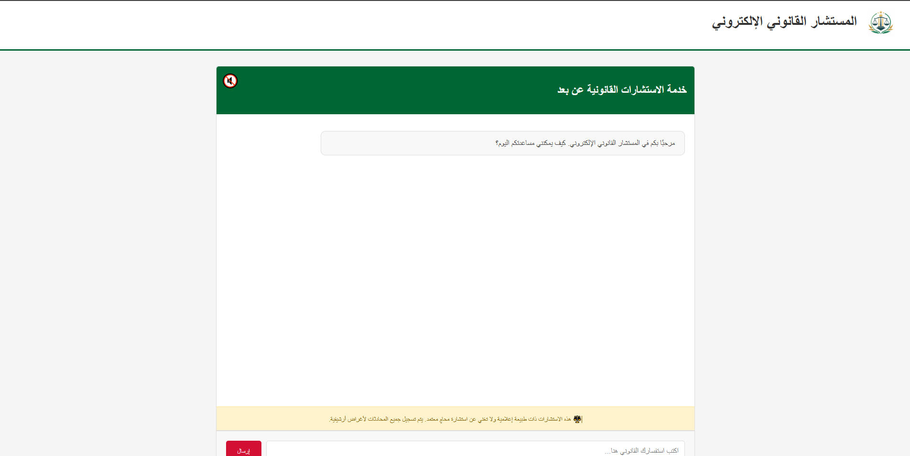

**Moustachar**
================

Moustachar is an AI-powered chatbot designed to answer legal questions based on Algerian law. It uses a Retrieval-Augmented Generation (RAG) approach over a collection of Algerian legal documents to provide precise, context-aware responses.

How It Was Made
---------------

- **Legal Document Collection & Parsing**  
  I downloaded multiple laws from various Algerian ministries. A custom script (`pdf.py`) reads each PDF, extracts text, and organizes every law by its domain and chapter, storing the result as structured JSON files.

- **Embeddings & Retrieval Setup**  
  Using `nomic-embed-text`, I converted all JSON documents into vector embeddings. To improve retrieval precision, I incorporated metadata (e.g., field, chapter) and a curated set of keywords during the indexing process.

- **RAG Integration with Ollama**  
 The core generation pipeline leverages the Ollama deepseek-r1 (32B) model. For each user query, the system retrieves the top‑K most relevant contexts via similarity search, with boosted relevance using document metadata (chapter and field) and a curated set of keywords. These enhanced contexts are then supplied alongside the user’s question to the LLM, producing a precise, law‑based answer.

- **API & Hosting**  
  The retrieval and generation components are exposed through a Flask API (`Server.py`). This endpoint accepts POST requests containing a legal question and responds with the chatbot’s answer in JSON format.

- **Frontend Interface**  
  A lightweight web UI built with HTML, CSS, and JavaScript (`index.html`) provides an interactive chat interface, sending user queries to the Flask backend and displaying responses seamlessly.

  

